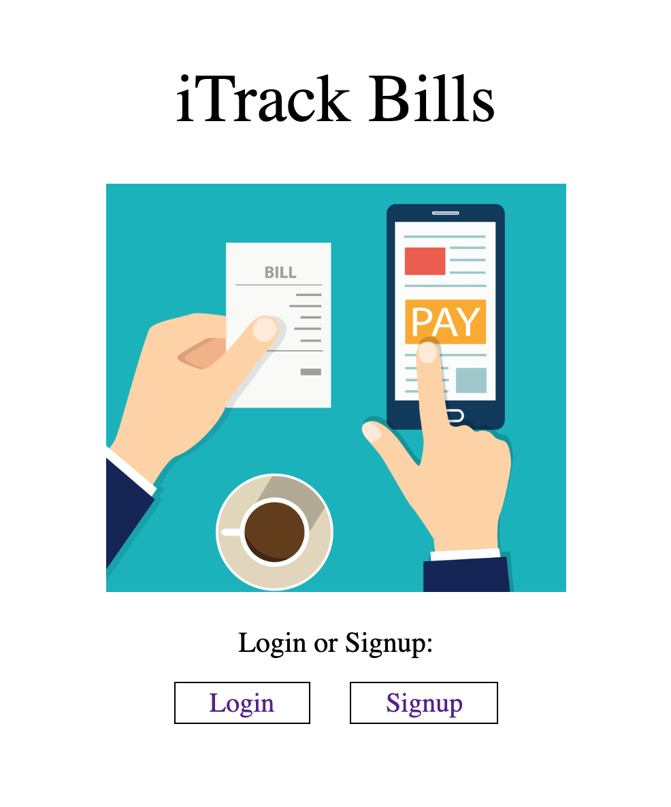
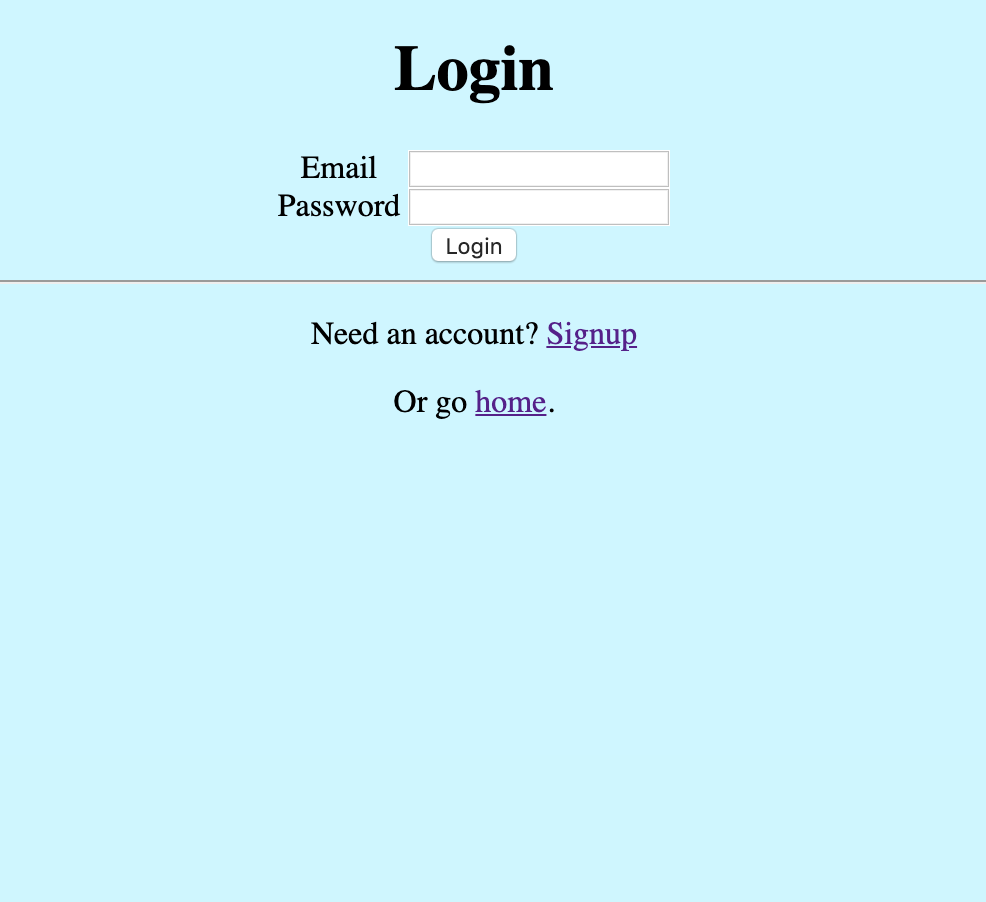
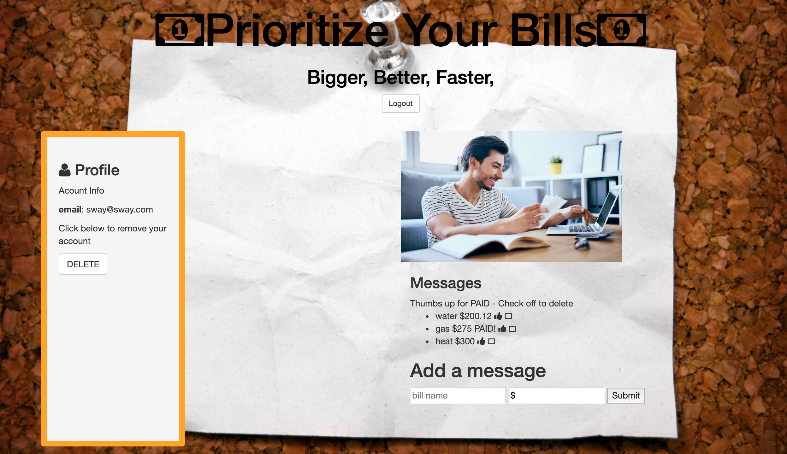
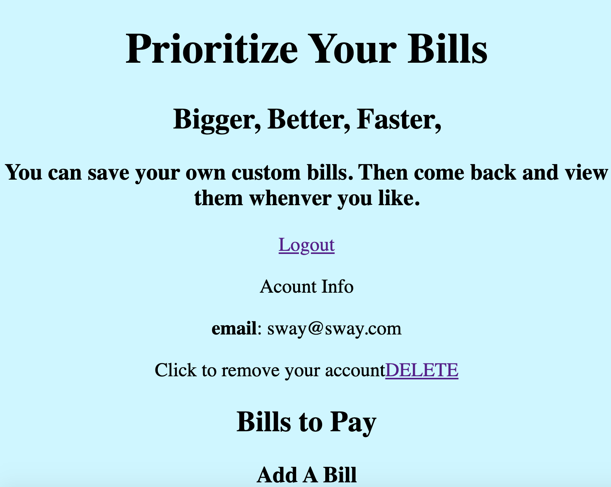

# ✅ Personal FullStack Bill Handler App
No one like to pay bills.  Even less having to manage them all.  Therefore I built this Full Stack application in order to remove some of the stress that come with having to pay bills.

Everyone is able to sign up with their own individual account.  They will then have their own  bills saved to their accounts  All the math that is done in order to calculate you bill total is done server side using Node.js.  Users can then mark of bill as payed as well as delete them from the list.

## Tech Used:
- HTML5
- CSS3
- Javascript
- Node.js
- Express
- Mongo DB

## Installation

1. Clone repo
2. run `npm install`

## Usage

1. run `node server.js`
2. Navigate to `localhost:8080`
3. Have fun ;)

## Credit

Modified from Scotch.io's auth tutorial
